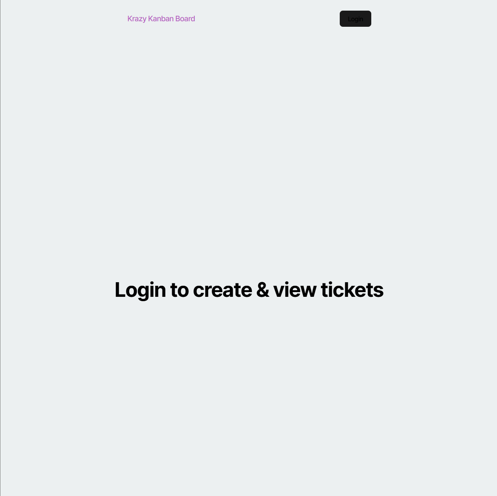
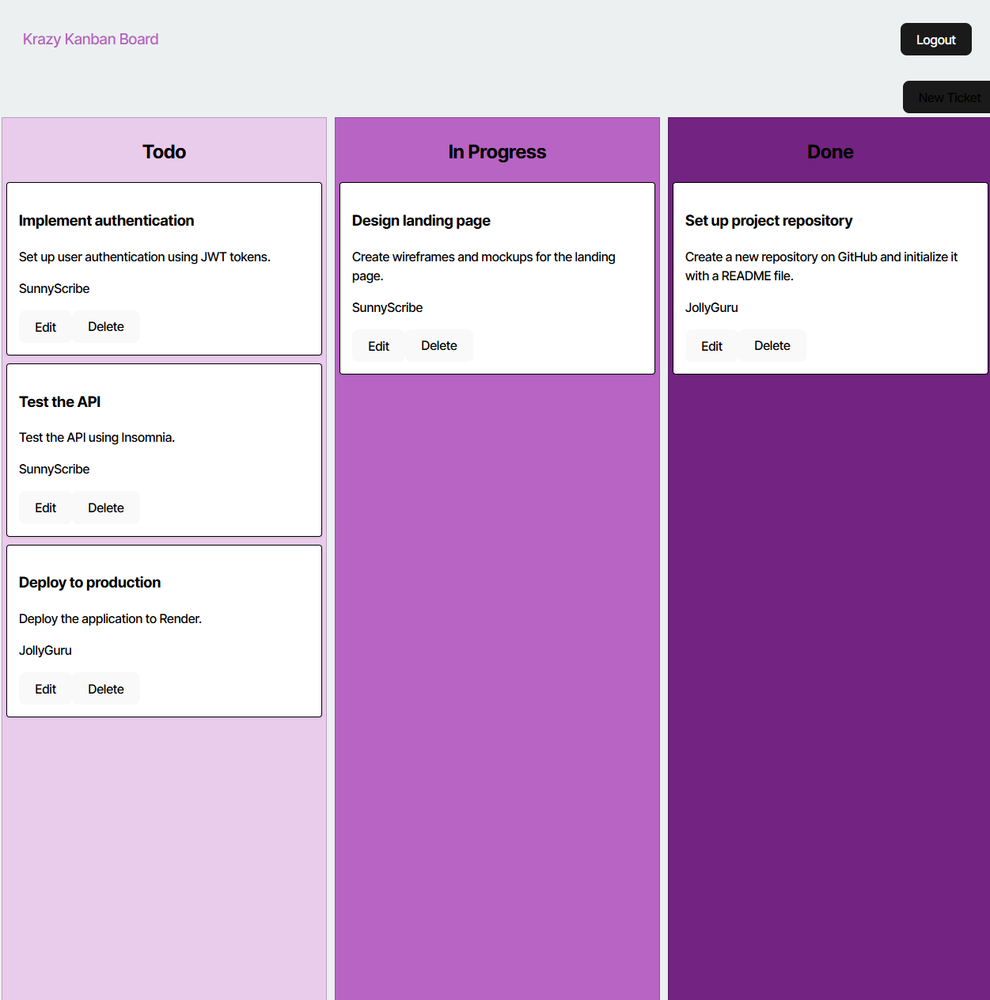
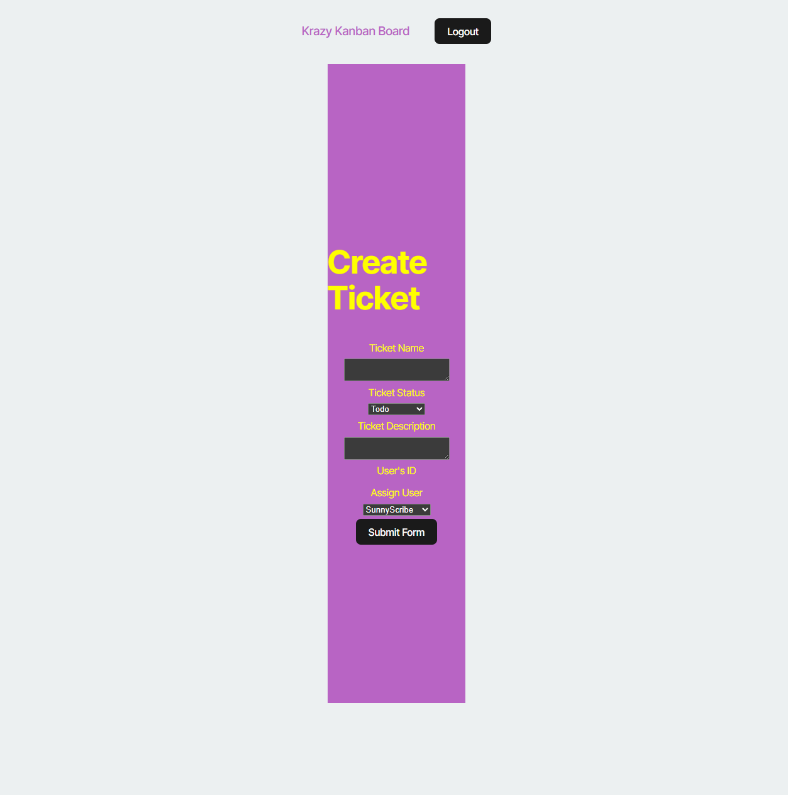

# Kanban Board with JWT Authentication

## Description

This is a secure Kanban board application that allows agile teams to manage their work tasks through a visual board interface. The application features JWT (JSON Web Token) authentication to ensure secure access, and implements a full PERN stack architecture with PostgreSQL for data persistence.

Users can log in securely, view tasks organized in Todo/In Progress/Done columns, create new tasks, edit existing tasks, and delete completed items. All API routes are protected with JWT authentication middleware.

## Table of Contents

- [Installation](#installation)
- [Usage](#usage)
- [Features](#features)
- [Technologies](#technologies)
- [API Routes](#api-routes)
- [Screenshots](#screenshots)
- [Deployed Application](#deployed-application)
- [Contributing](#contributing)
- [Tests](#tests)
- [Questions](#questions)
- [License](#license)

## Installation

To install and run this application locally:

```bash
# Clone the repository
git clone https://github.com/jadenszewczak/kanban-board-jwt-authentication.git

# Navigate to the project directory
cd kanban-board-jwt-authentication

# Install dependencies
npm install

# Set up PostgreSQL database
# Create a database named 'kanban_db' in PostgreSQL

# Create .env file in server folder with:
DB_NAME='kanban_db'
DB_USER='postgres'
DB_PASSWORD='your_password'
JWT_SECRET_KEY='your-super-secret-jwt-key'

# Seed the database
npm run seed

# Start the application
npm run start:dev
```

## Usage

1. Navigate to <http://localhost:3000>
2. Log in with one of the seeded users:
   - Username: `RadiantComet`, Password: `password`
   - Username: `JollyGuru`, Password: `password`
   - Username: `SunnyScribe`, Password: `password`
3. Once logged in, you can:
   - View all tasks on the Kanban board
   - Create new tasks using the "New Ticket" button
   - Edit tasks by clicking "Edit" on any card
   - Delete tasks by clicking "Delete" on any card
   - Move tasks between columns by editing their status
   - Log out using the "Logout" button

## Features

- **Secure Authentication**: JWT-based authentication system
- **Session Management**: Tokens stored in localStorage with expiration handling
- **Protected Routes**: All API endpoints require valid authentication
- **Full CRUD Operations**: Create, Read, Update, and Delete tasks
- **User Assignment**: Assign tasks to different team members
- **Responsive Design**: Works on desktop and mobile devices
- **Real-time Updates**: Board updates immediately after changes

## Technologies

### Frontend

- React 18
- TypeScript
- React Router DOM
- JWT-Decode
- Vite

### Backend

- Node.js
- Express.js
- TypeScript
- PostgreSQL
- Sequelize ORM
- JWT (jsonwebtoken)
- Bcrypt

### Deployment

- Render (Backend)
- PostgreSQL on Render

## API Routes

### Authentication

- `POST /auth/login` - User login

### Tickets (Protected Routes)

- `GET /api/tickets` - Get all tickets
- `GET /api/tickets/:id` - Get ticket by ID
- `POST /api/tickets` - Create new ticket
- `PUT /api/tickets/:id` - Update ticket
- `DELETE /api/tickets/:id` - Delete ticket

### Users (Protected Routes)

- `GET /api/users` - Get all users
- `GET /api/users/:id` - Get user by ID

## Screenshots

### Login Page



### Kanban Board



### Create Ticket



## Deployed Application

- **Live Backend API**: [https://kanban-board-jwt-jsg6.onrender.com](https://kanban-board-jwt-jsg6.onrender.com)
- **GitHub Repository**: [https://github.com/jadenszewczak/kanban-board-jwt-authentication](https://github.com/jadenszewczak/kanban-board-jwt-authentication)

**Note**: The backend API is deployed on Render. For full functionality, run the frontend locally using `npm run client:dev`.

## Contributing

Contributions are welcome! Please follow these steps:

1. Fork the repository
2. Create a feature branch (`git checkout -b feature/AmazingFeature`)
3. Commit your changes (`git commit -m 'Add some AmazingFeature'`)
4. Push to the branch (`git push origin feature/AmazingFeature`)
5. Open a Pull Request

## Tests

Currently, no automated tests are implemented. To test manually:

1. Test user authentication by logging in/out
2. Test CRUD operations on tickets
3. Verify JWT token expiration handling
4. Test API endpoints using Insomnia or Postman

## Questions

For questions about this project, please reach out:

- GitHub: [jadenszewczak](https://github.com/jadenszewczak)
- Email: [jaden.szewczak@wakefern.com]

## License

This project is licensed under the MIT License - see the [LICENSE](LICENSE) file for details
